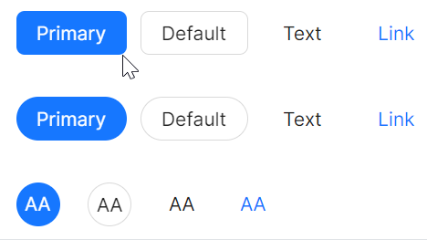
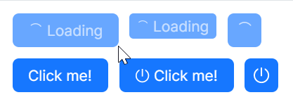
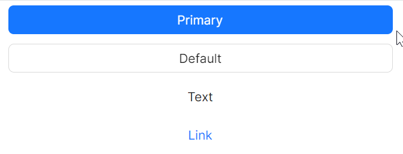

# Button

AtomUI提供了多种风格的按钮，用户可以按形状、尺寸、颜色、图标和文字等不同维度进行组合，生成最终满足自己需求的按钮。

## 基本用法


```xml
<atom:Button ButtonType="Primary">Primary Button</atom:Button>
<atom:Button>Default Button</atom:Button>
<atom:Button ButtonType="Text">Text Button</atom:Button>
<atom:Button ButtonType="Link">Link Button</atom:Button>
```

## 外观用例



按钮的外观由 `Shape` 与 `ButtonType` 共同决定。

`Shape` 属性：一共有Default、Circle、Round三个值，分别对应默认按钮、圆形按钮、圆角按钮；默认为Default。

`ButtonType` 属性：一共有Primary、Default、Text、Link四个值，分别对应主要按钮、默认按钮、文本按钮、链接按钮；默认为Default。

```xml
<atom:Button ButtonType="Primary" Shape="Round">Primary</atom:Button>
<atom:Button Shape="Round">Default</atom:Button>
<atom:Button ButtonType="Text" Shape="Round">Text</atom:Button>
<atom:Button ButtonType="Link" Shape="Round">Link</atom:Button>

<atom:Button ButtonType="Primary" Shape="Circle">AA</atom:Button>
<atom:Button Shape="Circle">AA</atom:Button>
<atom:Button ButtonType="Text" Shape="Circle">AA</atom:Button>
<atom:Button ButtonType="Link" Shape="Circle">AA</atom:Button>
```

## 大小用例


按钮的大小由 `SizeType` 属性决定，一共有Large、Middle、Small三个值；默认为Middle。

```xml
<atom:Button SizeType="Small">Text</atom:Button>
<atom:Button>Text</atom:Button>
<atom:Button SizeType="Middle">Text</atom:Button>
<atom:Button SizeType="Large">Text</atom:Button>
```

## 自定义图标用例


按钮的图标由 `Icon` 属性决定，而 `Icon` 也是由 `AtomUI` 提供的基础组件，详情参考 `Icon` 章节。

```xml
<atom:Button ButtonType="Primary" 
             Shape="Circle" 
             Icon="{atom:IconProvider Kind=SearchOutlined}" />
<atom:Button ButtonType="Primary" 
             Shape="Round"
             Icon="{atom:IconProvider Kind=SearchOutlined}">Search</atom:Button>
<atom:Button ButtonType="Default" 
             Shape="Circle" 
             Icon="{atom:IconProvider Kind=SearchOutlined}" />
<atom:Button ButtonType="Default" 
             Shape="Round" 
             Icon="{atom:IconProvider Kind=SearchOutlined}">Search</atom:Button>
<atom:Button ButtonType="Text" 
             Shape="Default" 
             Icon="{atom:IconProvider Kind=SearchOutlined}">Search</atom:Button>
<atom:Button ButtonType="Link" 
             Shape="Default" 
             Icon="{atom:IconProvider Kind=SearchOutlined}">Search</atom:Button>
```

## 加载动画用例



按钮的加载动画由 `IsLoading` 属性决定，一共有True、False两个值；默认为False。

```xml
<atom:Button ButtonType="Primary" IsLoading="True" Icon="{atom:IconProvider Kind=PoweroffOutlined}" />
```

## 块级用例



按钮的块级属性由 `HorizontalAlignment` 属性决定，当值为Stretch时，按钮会占满父容器的宽度。

```xml
<atom:Button ButtonType="Primary" 
             HorizontalAlignment="Stretch">Primary</atom:Button>
<atom:Button ButtonType="Default" 
             HorizontalAlignment="Stretch">Default</atom:Button>
<atom:Button ButtonType="Text" 
             HorizontalAlignment="Stretch">Text</atom:Button>
<atom:Button ButtonType="Link" 
             HorizontalAlignment="Stretch">Link</atom:Button>
```

## 危险用例


按钮的危险属性由 `IsDanger` 属性决定，一共有True和False两个值；默认为False。

```xml
<atom:Button ButtonType="Primary" IsDanger="True">Primary</atom:Button>
<atom:Button ButtonType="Default" IsDanger="True">Default</atom:Button>
<atom:Button ButtonType="Text" IsDanger="True">Text</atom:Button>
<atom:Button ButtonType="Link" IsDanger="True">Link</atom:Button>
```

## 幽灵用例


按钮的幽灵属性由 `IsGhost` 属性决定，一共有True和False两个值；默认为False。

```xml
<atom:Button ButtonType="Primary" IsGhost="True">Primary</atom:Button>
<atom:Button ButtonType="Default" IsGhost="True">Default</atom:Button>
<atom:Button ButtonType="Text" IsGhost="True">Text</atom:Button>
<atom:Button ButtonType="Link" IsGhost="True">Link</atom:Button>
<atom:Button ButtonType="Primary" IsDanger="True" IsGhost="True">Danger</atom:Button>
```

## 禁用用例


按钮的禁用属性由 `IsEnabled` 属性决定，一共有True和False两个值；默认为True。

```xml
<atom:Button ButtonType="Primary" IsEnabled="False">Primary(disabled)</atom:Button>
<atom:Button ButtonType="Default" IsEnabled="False">Default(disabled)</atom:Button>
<atom:Button ButtonType="Text" IsEnabled="False">Text(disabled)</atom:Button>
<atom:Button ButtonType="Link" IsEnabled="False">Link(disabled)</atom:Button>
```