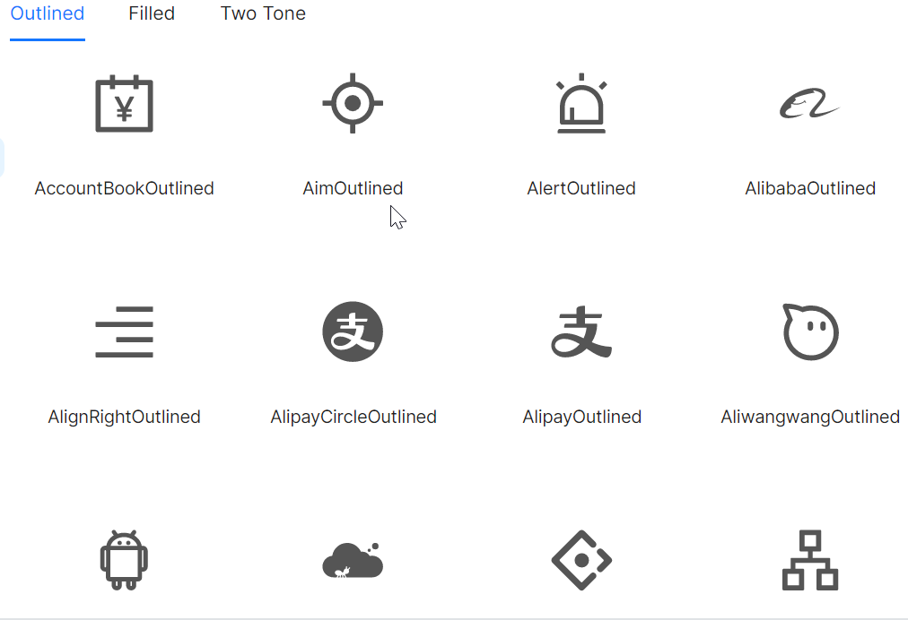

# Icons

AtomUI内置了一些常用的Icons图标，通过 `Icons` 组件进行使用。

## 基本用法



在使用 `Icons` 组件时，需要设置 `Kind` 属性，该属性的值为 `IconKind` 枚举中的值。使用时，在支持 `Icon` 属性的组件中，直接使用 `Icons` 组件即可。

```xml
<atom:Button ButtonType="Primary" 
             Shape="Circle" 
             Icon="{atom:IconProvider Kind=SearchOutlined}" />
```

所有可用的Kind值，參考 `namespace AtomUI.IconPkg.AntDesign` 下的 `AntDesignIconKind` 枚举。