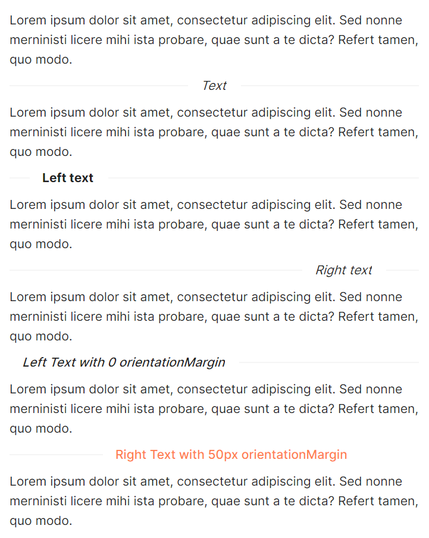

# Separator

`AtomUI` 提供了一套简洁精美的分割线组件。

## 基本用法


```xml
<atom:TextBlock TextWrapping="Wrap">
    Lorem ipsum dolor sit amet, consectetur adipiscing elit. Sed nonne merninisti licere mihi ista probare, quae sunt a te dicta? Refert tamen, quo modo.
</atom:TextBlock>
<atom:Separator Title="Title text" />
<atom:TextBlock TextWrapping="Wrap">
    Lorem ipsum dolor sit amet, consectetur adipiscing elit. Sed nonne merninisti licere mihi ista probare, quae sunt a te dicta? Refert tamen, quo modo.
</atom:TextBlock>
<atom:Separator Title="Title text" />
<atom:TextBlock TextWrapping="Wrap">
    Lorem ipsum dolor sit amet, consectetur adipiscing elit. Sed nonne merninisti licere mihi ista probare, quae sunt a te dicta? Refert tamen, quo modo.
</atom:TextBlock>
```

## 文字分割线用例



```xml
<atom:TextBlock TextWrapping="Wrap">
    Lorem ipsum dolor sit amet, consectetur adipiscing elit. Sed nonne merninisti licere mihi ista probare, quae sunt a te dicta? Refert tamen, quo modo.
</atom:TextBlock>
<atom:Separator Title="Text" FontStyle="Italic" />
<atom:TextBlock TextWrapping="Wrap">
Lorem ipsum dolor sit amet, consectetur adipiscing elit. Sed nonne merninisti licere mihi ista probare, quae sunt a te dicta? Refert tamen, quo modo.
</atom:TextBlock>
<atom:Separator Title="Left text" TitlePosition="Left" FontWeight="Bold" />
<atom:TextBlock TextWrapping="Wrap">
Lorem ipsum dolor sit amet, consectetur adipiscing elit. Sed nonne merninisti licere mihi ista probare, quae sunt a te dicta? Refert tamen, quo modo.
</atom:TextBlock>
<atom:Separator Title="Right text" TitlePosition="Right" FontStyle="Oblique" />
<atom:TextBlock TextWrapping="Wrap">
Lorem ipsum dolor sit amet, consectetur adipiscing elit. Sed nonne merninisti licere mihi ista probare, quae sunt a te dicta? Refert tamen, quo modo.
</atom:TextBlock>
<atom:Separator Title="Left Text with 0 orientationMargin" TitlePosition="Left" FontStyle="Oblique"
                FontWeight="Medium" OrientationMargin="0" />
<atom:TextBlock TextWrapping="Wrap">
Lorem ipsum dolor sit amet, consectetur adipiscing elit. Sed nonne merninisti licere mihi ista probare, quae sunt a te dicta? Refert tamen, quo modo.
</atom:TextBlock>

<atom:Separator Title="Right Text with 50px orientationMargin" TitlePosition="Right" TitleColor="Coral"
                FontWeight="Medium"
                OrientationMargin="50" />
<atom:TextBlock TextWrapping="Wrap">
Lorem ipsum dolor sit amet, consectetur adipiscing elit. Sed nonne merninisti licere mihi ista probare, quae sunt a te dicta? Refert tamen, quo modo.
</atom:TextBlock>
```

## 垂直分割用例


```xml
<atom:TextBlock>
    Item1
</atom:TextBlock>
<atom:VerticalSeparator Title="Right text" />
<atom:TextBlock>
    Item2
</atom:TextBlock>
<atom:VerticalSeparator />
<atom:TextBlock>
    Item3
</atom:TextBlock>
```