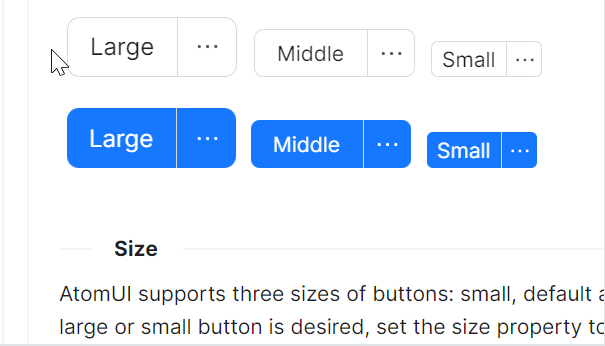
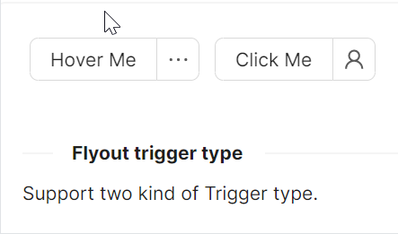

# SplitButton

`AtomUI` 提供了一套分裂按钮组件，即 `SplitButton` 。为按钮提供了更多的扩展性操作空间与能力。分裂按钮是基于 `Flyout` 与 `Menu` 两个基础组件构建的。

## 基本用法


```xml
<atom:SplitButton TriggerType="Hover">
    Hover me
    <atom:SplitButton.Flyout>
        <atom:MenuFlyout>
            <atom:MenuItem Header="Cut" InputGesture="Ctrl+X"
                           Icon="{atom:IconProvider Kind=ScissorOutlined}" />
            <atom:MenuItem Header="Copy" InputGesture="Ctrl+C" Icon="{atom:IconProvider Kind=CopyOutlined}" />
            <atom:MenuItem Header="Delete" InputGesture="Ctrl+D"
                           Icon="{atom:IconProvider Kind=DeleteOutlined}" />
        </atom:MenuFlyout>
    </atom:SplitButton.Flyout>
</atom:SplitButton>
```

## 尺寸用例



分裂按钮的尺寸由 `SizeType` 属性决定，一共有Large、Middle、Small三个值；默认为Middle。

```xml
<atom:SplitButton SizeType="Large">
    Large
    <atom:SplitButton.Flyout>
        <atom:MenuFlyout>
            <atom:MenuItem Header="Cut" InputGesture="Ctrl+X"
                           Icon="{atom:IconProvider Kind=ScissorOutlined}" />
            <atom:MenuItem Header="Copy" InputGesture="Ctrl+C"
                           Icon="{atom:IconProvider Kind=CopyOutlined}" />
            <atom:MenuItem Header="Delete" InputGesture="Ctrl+D"
                           Icon="{atom:IconProvider Kind=DeleteOutlined}" />
        </atom:MenuFlyout>
    </atom:SplitButton.Flyout>
</atom:SplitButton>
<atom:SplitButton SizeType="Middle">
    Middle
    <atom:SplitButton.Flyout>
        <atom:MenuFlyout>
            <atom:MenuItem Header="Cut" InputGesture="Ctrl+X"
                           Icon="{atom:IconProvider Kind=ScissorOutlined}" />
            <atom:MenuItem Header="Copy" InputGesture="Ctrl+C"
                           Icon="{atom:IconProvider Kind=CopyOutlined}" />
            <atom:MenuItem Header="Delete" InputGesture="Ctrl+D"
                           Icon="{atom:IconProvider Kind=DeleteOutlined}" />
        </atom:MenuFlyout>
    </atom:SplitButton.Flyout>
</atom:SplitButton>
<atom:SplitButton SizeType="Small">
    Small
    <atom:SplitButton.Flyout>
        <atom:MenuFlyout>
            <atom:MenuItem Header="Cut" InputGesture="Ctrl+X"
                           Icon="{atom:IconProvider Kind=ScissorOutlined}" />
            <atom:MenuItem Header="Copy" InputGesture="Ctrl+C"
                           Icon="{atom:IconProvider Kind=CopyOutlined}" />
            <atom:MenuItem Header="Delete" InputGesture="Ctrl+D"
                           Icon="{atom:IconProvider Kind=DeleteOutlined}" />
        </atom:MenuFlyout>
    </atom:SplitButton.Flyout>
</atom:SplitButton>
```

## 危险用例


分裂菜单的危险属性由 `IsDanger` 属性决定，一共有True和False两个值；默认为False。

```xml
<atom:SplitButton IsDanger="true">
    Default
    <atom:SplitButton.Flyout>
        <atom:MenuFlyout>
            <atom:MenuItem Header="Cut" InputGesture="Ctrl+X"
                           Icon="{atom:IconProvider Kind=ScissorOutlined}" />
            <atom:MenuItem Header="Copy" InputGesture="Ctrl+C"
                           Icon="{atom:IconProvider Kind=CopyOutlined}" />
            <atom:MenuItem Header="Delete" InputGesture="Ctrl+D"
                           Icon="{atom:IconProvider Kind=DeleteOutlined}" />
        </atom:MenuFlyout>
    </atom:SplitButton.Flyout>
</atom:SplitButton>

<atom:SplitButton IsDanger="true" IsPrimaryButtonType="True">
    Primary
    <atom:SplitButton.Flyout>
        <atom:MenuFlyout>
            <atom:MenuItem Header="Cut" InputGesture="Ctrl+X"
                           Icon="{atom:IconProvider Kind=ScissorOutlined}" />
            <atom:MenuItem Header="Copy" InputGesture="Ctrl+C"
                           Icon="{atom:IconProvider Kind=CopyOutlined}" />
            <atom:MenuItem Header="Delete" InputGesture="Ctrl+D"
                           Icon="{atom:IconProvider Kind=DeleteOutlined}" />
        </atom:MenuFlyout>
    </atom:SplitButton.Flyout>
</atom:SplitButton>
```

## 自定义图标用例


分裂菜单的图标由 `Icon` 属性决定，而 `Icon` 也是由 `AtomUI` 提供的基础组件，详情参考 `Icon` 章节。

```xml
<atom:SplitButton>
    Default
    <atom:SplitButton.Flyout>
        <atom:MenuFlyout>
            <atom:MenuItem Header="Cut" InputGesture="Ctrl+X"
                           Icon="{atom:IconProvider Kind=ScissorOutlined}" />
            <atom:MenuItem Header="Copy" InputGesture="Ctrl+C"
                           Icon="{atom:IconProvider Kind=CopyOutlined}" />
            <atom:MenuItem Header="Delete" InputGesture="Ctrl+D"
                           Icon="{atom:IconProvider Kind=DeleteOutlined}" />
        </atom:MenuFlyout>
    </atom:SplitButton.Flyout>
</atom:SplitButton>

<atom:SplitButton FlyoutButtonIcon="{atom:IconProvider Kind=UserOutlined}">
    Primary
    <atom:SplitButton.Flyout>
        <atom:MenuFlyout>
            <atom:MenuItem Header="Cut" InputGesture="Ctrl+X"
                           Icon="{atom:IconProvider Kind=ScissorOutlined}" />
            <atom:MenuItem Header="Copy" InputGesture="Ctrl+C"
                           Icon="{atom:IconProvider Kind=CopyOutlined}" />
            <atom:MenuItem Header="Delete" InputGesture="Ctrl+D"
                           Icon="{atom:IconProvider Kind=DeleteOutlined}" />
        </atom:MenuFlyout>
    </atom:SplitButton.Flyout>
</atom:SplitButton>
```

## 触发方式用例



分裂按钮的触发方式由 `TriggerType` 确定，一共有Click和Hover两个值；默认为Click。

```xml
<atom:SplitButton TriggerType="Hover">
    Hover Me
    <atom:SplitButton.Flyout>
        <atom:MenuFlyout>
            <atom:MenuItem Header="Cut" InputGesture="Ctrl+X"
                           Icon="{atom:IconProvider Kind=ScissorOutlined}" />
            <atom:MenuItem Header="Copy" InputGesture="Ctrl+C"
                           Icon="{atom:IconProvider Kind=CopyOutlined}" />
            <atom:MenuItem Header="Delete" InputGesture="Ctrl+D"
                           Icon="{atom:IconProvider Kind=DeleteOutlined}" />
        </atom:MenuFlyout>
    </atom:SplitButton.Flyout>
</atom:SplitButton>

<atom:SplitButton FlyoutButtonIcon="{atom:IconProvider Kind=UserOutlined}" TriggerType="Click">
    Click Me
    <atom:SplitButton.Flyout>
        <atom:MenuFlyout>
            <atom:MenuItem Header="Cut" InputGesture="Ctrl+X"
                           Icon="{atom:IconProvider Kind=ScissorOutlined}" />
            <atom:MenuItem Header="Copy" InputGesture="Ctrl+C"
                           Icon="{atom:IconProvider Kind=CopyOutlined}" />
            <atom:MenuItem Header="Delete" InputGesture="Ctrl+D"
                           Icon="{atom:IconProvider Kind=DeleteOutlined}" />
        </atom:MenuFlyout>
    </atom:SplitButton.Flyout>
</atom:SplitButton>
```